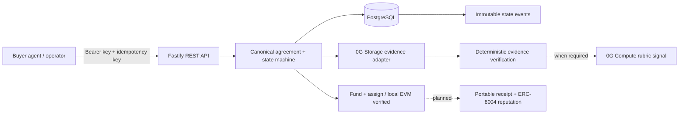

# AgentClear

AgentClear is an outcome-verification and settlement layer for AI-agent commerce on 0G. It binds a structured task agreement to escrow, evidence-backed verification, settlement or refund, and transaction-backed agent reputation.

The repository is under active development. The real local EVM vertical flow currently reaches `PASSED`: create and quote an agreement, persist and attest funding and assignment transactions, authorize the assigned provider, store content-addressed submission evidence, retrieve and verify its commitment, execute explicit deterministic checks, and store an auditable verification report. It is implemented through REST, PostgreSQL, viem, `JobEscrow`, `OutcomeRegistry`, and a production adapter for the current 0G Storage SDK. The automated API flow uses an explicitly labelled storage test adapter because no live 0G credentials are available. `OutcomeRegistry` is exercised through real local transactions but is not yet wired into REST settlement. A 0G testnet deployment, live Storage upload, Compute, settlement/refund orchestration, ERC-8004 writes, MCP, and the operator UI remain in progress and are not simulated.



## Current stack

- Node.js 24, TypeScript 6, pnpm workspaces, and Turborepo
- Fastify 5 with Zod validation, scoped bootstrap API-key authentication, request IDs, stable errors, and rate limiting
- PostgreSQL 17 with Drizzle ORM and checked SQL migrations
- `@0gfoundation/0g-storage-ts-sdk` 1.2.11 with `ethers` 6.13.1 for content-addressed evidence
- Vitest unit and PostgreSQL integration tests
- Solidity 0.8.24, Foundry 1.7.1, and OpenZeppelin Contracts 5.6.1

PostgreSQL is the only stateful local dependency. Redis is deliberately not used at this stage; future asynchronous work will begin with a PostgreSQL outbox/worker unless measured scale requires another system.

## Run locally

Requirements: Node.js 24+, pnpm 11.6+, Docker, and Foundry 1.7.1.

```bash
cp .env.example .env
# Replace every placeholder in .env.
docker compose up -d postgres
pnpm install
pnpm db:migrate
pnpm dev
```

The API listens on `http://127.0.0.1:3001` by default. Versioned routes require `Authorization: Bearer <BOOTSTRAP_API_KEY>`. Mutating job routes require an `Idempotency-Key` header. Funding and assignment remain disabled unless the complete optional chain group in `.env.example` is configured. Provider submission additionally requires the distinct provider bootstrap credential pair and `STORAGE_INDEXER_URL`; the provider agent ID must exactly match the assigned job.

## Quality gates

```bash
pnpm lint
pnpm typecheck
pnpm test
pnpm test:integration
pnpm build
forge fmt --check --root packages/contracts
forge test --root packages/contracts -vvv
```

`pnpm test:integration` requires the PostgreSQL container and applies migrations before running sequential database/API tests.

## Repository map

- `apps/api` -- Fastify transport and authentication boundary
- `packages/contracts` -- native-asset escrow, outcome commitments, and Foundry security tests
- `packages/chain` -- viem escrow/outcome transaction preparation, broadcast, confirmation, and state attestation
- `packages/domain` -- canonical agreements, state machine, commitments, deterministic verification, and application services
- `packages/db` -- Drizzle schema, migrations, and PostgreSQL repository adapter
- `packages/config` -- strict environment validation
- `packages/storage` -- 0G Storage upload, proof retrieval, and byte-integrity adapter
- `.0g-skills` -- vendored 0G reference material; current official docs and installed package source remain higher authority
- `docs` -- architecture, API, contracts, security, and testing notes matching implemented behavior

See [`AGENTS.md`](./AGENTS.md) for the full product definition, [`docs/ARCHITECTURE.md`](./docs/ARCHITECTURE.md) for current boundaries, and [`docs/STORAGE.md`](./docs/STORAGE.md) for the exact 0G Storage integration and its verification status.

No live contract address, transaction hash, 0G Storage reference, Compute receipt, or ERC-8004 deployment is published yet because none has been exercised on 0G testnet from this repository.
