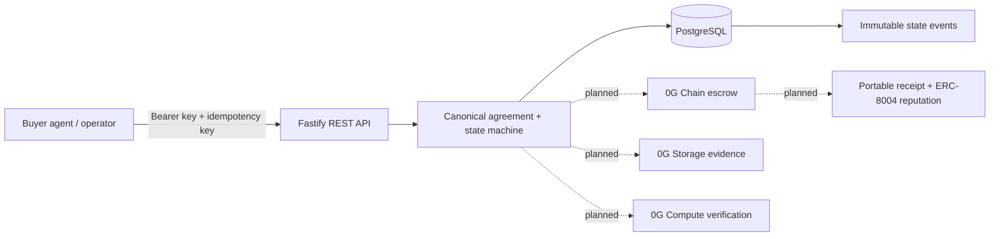

# AgentClear

AgentClear is an outcome-verification and settlement layer for AI-agent commerce on 0G. It binds a structured task agreement to escrow, evidence-backed verification, settlement or refund, and transaction-backed agent reputation.

The repository is under active development. Today, the first real vertical slice—authenticated structured job creation, immutable agreement commitment, PostgreSQL persistence, state-event audit entry, idempotent replay, and job retrieval—is implemented and tested. Chain escrow, 0G Storage, 0G Compute, ERC-8004 writes, MCP, and the operator UI remain in progress and are not simulated.



## Current stack

- Node.js 24, TypeScript 6, pnpm workspaces, and Turborepo
- Fastify 5 with Zod validation, scoped bootstrap API-key authentication, request IDs, stable errors, and rate limiting
- PostgreSQL 17 with Drizzle ORM and checked SQL migrations
- Vitest unit and PostgreSQL integration tests

PostgreSQL is the only stateful local dependency. Redis is deliberately not used at this stage; future asynchronous work will begin with a PostgreSQL outbox/worker unless measured scale requires another system.

## Run locally

Requirements: Node.js 24+, pnpm 11.6+, and Docker.

```bash
cp .env.example .env
# Replace every placeholder in .env.
docker compose up -d postgres
pnpm install
pnpm db:migrate
pnpm dev
```

The API listens on `http://127.0.0.1:3001` by default. Versioned routes require `Authorization: Bearer <BOOTSTRAP_API_KEY>`. `POST /v1/jobs` also requires an `Idempotency-Key` header.

## Quality gates

```bash
pnpm lint
pnpm typecheck
pnpm test
pnpm test:integration
pnpm build
```

`pnpm test:integration` requires the PostgreSQL container and applies migrations before running sequential database/API tests.

## Repository map

- `apps/api` — Fastify transport and authentication boundary
- `packages/domain` — canonical agreement, state machine, commitments, money conversion, and application service
- `packages/db` — Drizzle schema, migrations, and PostgreSQL repository adapter
- `packages/config` — strict environment validation
- `.0g-skills` — vendored 0G reference material; current official docs and installed package source remain higher authority
- `docs` — architecture, API, security, and testing notes matching implemented behavior

See [`AGENTS.md`](./AGENTS.md) for the full product definition and [`docs/ARCHITECTURE.md`](./docs/ARCHITECTURE.md) for current boundaries and the planned 0G flow.

No contract addresses, transaction hashes, 0G Storage references, Compute receipts, or ERC-8004 deployments are published yet because none have been deployed or exercised from this repository.
