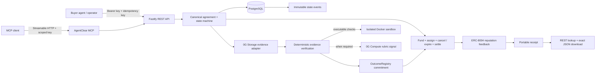

# AgentClear

AgentClear is an outcome-verification and settlement layer for AI-agent commerce on 0G. It binds a structured task agreement to escrow, evidence-backed verification, settlement or refund, and transaction-backed agent reputation.

The repository is under active development. The real local EVM vertical flow now reaches both terminal payment outcomes: create and quote an agreement, fund escrow, assign the provider, store and verify evidence, anchor `PASS` or `FAIL` in `OutcomeRegistry`, release or refund `JobEscrow`, write outcome feedback through the current ERC-8004 `ReputationRegistry` interface, and publish a portable content-addressed receipt. Buyer cancellation and deadline expiry also execute real resumable escrow refunds. Executable deliverables can be evaluated in a real disposable, network-disabled Docker sandbox. A real MCP Streamable HTTP server exposes the working flow through the same REST/domain services, including funded cancellation. The automated flows use PostgreSQL, real signed Anvil transactions, deployed contracts, and explicitly labelled controlled Storage/Compute/sandbox ports where CI cannot use external credentials or a privileged container daemon. Production 0G Storage, 0G Compute, sandbox, MCP, and config-driven ERC-8004 adapters are implemented, but a 0G testnet deployment, live Storage/Compute/reputation proof, the remaining discovery/reputation MCP tools, and the operator UI remain in progress and are not simulated.



## Current stack

- Node.js 24, TypeScript 6, pnpm workspaces, and Turborepo
- Fastify 5 with Zod validation, PostgreSQL-backed scoped API keys and spending policies, one-time secret issuance, request IDs, stable errors, and rate limiting
- PostgreSQL 17 with Drizzle ORM and checked SQL migrations
- viem-based, config-driven ERC-8004 identity/reputation adapter using the current registry ABI
- `@0gfoundation/0g-storage-ts-sdk` 1.2.11 with `ethers` 6.13.1 for content-addressed evidence
- `@0gfoundation/0g-compute-ts-sdk` 0.9.0 with a dedicated wallet for rubric verification
- Digest-pinned Docker execution with network/root-filesystem/capability/resource isolation for untrusted Node.js modules
- Official MCP TypeScript SDK 1.30 with stateless Streamable HTTP and the caller's scoped REST credential
- Vitest unit and PostgreSQL integration tests
- Solidity 0.8.24, Foundry 1.7.1, and OpenZeppelin Contracts 5.6.1

PostgreSQL is the only stateful local dependency. Redis is deliberately not used at this stage; future asynchronous work will begin with a PostgreSQL outbox/worker unless measured scale requires another system.

## Run locally

Requirements: Node.js 24+, pnpm 11.6+, Docker, and Foundry 1.7.1.

```bash
cp .env.example .env
# Replace every placeholder in .env.
docker compose up -d postgres
pnpm install
pnpm db:migrate
pnpm dev
```

The API listens on `http://127.0.0.1:3001` and MCP on `http://127.0.0.1:3002/mcp` by default. Versioned routes and MCP requests require `Authorization: Bearer <scoped-api-key>`. Use the bootstrap operator key once to issue PostgreSQL-backed runtime keys through `POST /v1/api-keys`; plaintext secrets are returned only in that response. Before a principal can fund, an operator must create its durable capability/per-job/day/month policy through `PUT /v1/spending-policies/:principalId`; an optional threshold holds larger jobs for explicit approval. Mutating job operations require an idempotency key. New native-asset agreements require `refundPolicy.onExpiry: true`, matching the escrow's permissionless expiry-refund rule. Funding, assignment, and funded cancellation/expiry remain disabled unless the complete optional chain group in `.env.example` is configured; unfunded closure remains a database state transition. Outcome anchoring and final settlement additionally require `OUTCOME_REGISTRY_ADDRESS`. Transaction-backed reputation requires both ERC-8004 registry addresses. Provider submission requires a durable agent key (or the optional local provider bootstrap credential) whose principal ID exactly matches the assigned job, plus `STORAGE_INDEXER_URL`. AI verification additionally requires the complete `COMPUTE_*` group and a dedicated funded wallet that is not the protocol chain signer. Agreements containing `sandbox_tests` require `SANDBOX_NODE_IMAGE` to be an immutable image reference ending in `@sha256:<digest>`.

## Quality gates

```bash
pnpm lint
pnpm typecheck
pnpm test
pnpm test:integration
pnpm build
forge fmt --check --root packages/contracts
forge test --root packages/contracts -vvv
```

`pnpm test:integration` requires the PostgreSQL container and applies migrations before running sequential database/API tests.

## Repository map

- `apps/api` -- Fastify transport and authentication boundary
- `apps/mcp` -- official MCP Streamable HTTP adapter over the REST/application boundary
- `packages/contracts` -- native-asset escrow, outcome commitments, and Foundry security tests
- `packages/chain` -- viem escrow/outcome/ERC-8004 transaction preparation, broadcast, confirmation, and state attestation
- `packages/domain` -- canonical agreements, state machine, commitments, deterministic verification, and application services
- `packages/db` -- Drizzle schema, migrations, and PostgreSQL repository adapter
- `packages/config` -- strict environment validation
- `packages/compute` -- current 0G Compute SDK provider preflight, paid inference, and response verification adapter
- `packages/sandbox` -- disposable Docker code execution with strict host and resource isolation
- `packages/storage` -- 0G Storage upload, proof retrieval, and byte-integrity adapter
- `.0g-skills` -- vendored 0G reference material; current official docs and installed package source remain higher authority
- `docs` -- architecture, API, contracts, security, and testing notes matching implemented behavior

See [`AGENTS.md`](./AGENTS.md) for the full product definition, [`docs/ARCHITECTURE.md`](./docs/ARCHITECTURE.md) for current boundaries, [`docs/MCP.md`](./docs/MCP.md) for the machine tool surface, [`docs/STORAGE.md`](./docs/STORAGE.md) and [`docs/COMPUTE.md`](./docs/COMPUTE.md) for the exact 0G integrations, [`docs/SANDBOX.md`](./docs/SANDBOX.md) for untrusted-code isolation, [`docs/ERC8004.md`](./docs/ERC8004.md) for verified registry sources and configuration, and [`docs/RECEIPTS.md`](./docs/RECEIPTS.md) for receipt integrity and retrieval.

No live contract address, transaction hash, 0G Storage reference, Compute receipt, or ERC-8004 deployment is published yet because none has been exercised on 0G testnet from this repository.
